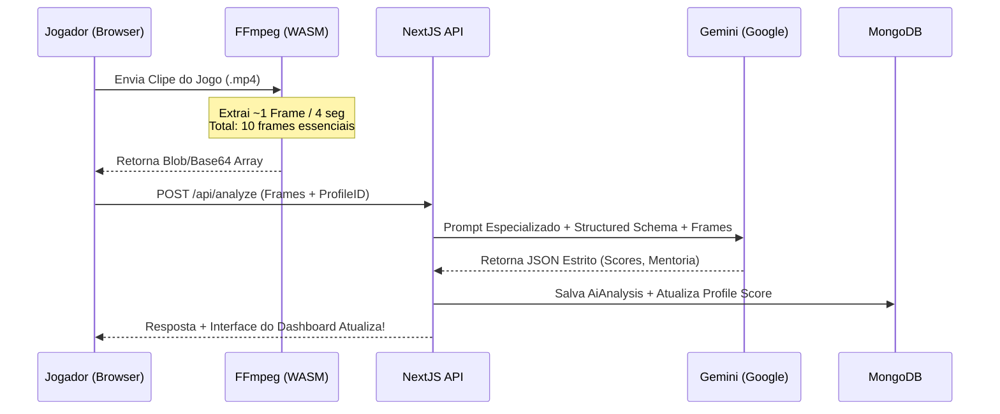

# Free Fire Elite Hub

> **Um ecossistema de monetização, performance e descoberta de talentos para jogadores de Free Fire.**

O **Free Fire Elite Hub** é uma plataforma inovadora alimentada por IA desenvolvida para profissionalizar o cenário amador e pro-player. O ecossistema permite que jogadores melhorem seu gameplay usando visão computacional, apostem de forma segura contra rivais em desafios e construam um portfólio rico em dados para entrarem no radar de guildas e organizações de alto nível.

---

## 🎯 Principais Funcionalidades

### 1. Perfil e Radar de Talentos (Gratuito)
Jogadores criam um "Currículo" da sua vida no Free Fire contendo nome, ID, bio, elo e um `Global Score`. Eles aparecem em um feed social filtrável que times podem utilizar como **Olheiros / Scouts**.

### 2. O "CT de Bolso" - Coach IA
Usuários fazem upload dos seus melhores ou piores momentos pelo próprio navegador. Através do processamento *client-side* seguro e rápido do nosso Hub com a tecnologia **Google Gemini Vision**, os jogadores extraem um Raio-X completo com pontuações rigorosas que variam de 0-100 para:
*   Movimentação e fluídez
*   Uso de Gel (Velocidade e posicionamento das *Gloo Walls*)
*   Eficiência de rotação (Sentido de mapa e timing)

### 3. Modulo de Desafios & Escrow (Apostas Seguras)
Idealização de confrontos (1v1 ou 4x4) criados pelo painel com taxa de aposta definida (ex: R$ 50). A plataforma atua como um árbitro seguro (escrow) travando os fundos de ambos na fase de ingresso.
A moderação das partidas e definição de vencedores também passam pela IA (Result Validator - RF06).

---

## 🏗️ Arquitetura do Sistema

O projeto foi construído usando uma arquitetura *API-First* combinada com as melhores práticas de DDD (Domain Driven Design) e do Next.js App Router para escalar de 1 a milhões de usuários sem dor de cabeça.

### Stack Tecnológica
*   **Apresentação:** Next.js 14+ (App Router), React 18, Server Components
*   **Estilização:** Tailwind CSS (v4), Shadcn/UI (Componentes Acessíveis), Framer Motion
*   **Banco de Dados:** MongoDB Atlas, Mongoose (como ODM)
*   **Autenticação:** NextAuth.js (v4 / Auth.js) + Adaptação MongoDB
*   **Inteligência Artificial:** Google Gemini API 2.5 Flash (`@google/genai` Structured Outputs)
*   **Vídeo & Mídia:** FFmpeg WebAssembly (`@ffmpeg/ffmpeg`) executado no Client-Side
*   **Infraestrutura:** Vercel (Edge & Serverless)

### Modelagem Direto ao Ponto

Coleções estruturadas no MongoDB encapsuladas em `/src/models`:
1.  **User**: Responsável pela camada de acesso (NextAuth), permissão (`FREE`, `PRO`) e saldo da carteira.
2.  **Profile**: Extensão pública do usuário, SEO-friendly, contendo métricas sociais e `global_score`.
3.  **AiAnalysis**: Onde salvamos todo o relatório granular de partida. A performance de cada frame cai no registro de métricas.
4.  **Challenge**: A sala do duelo. Controlada através de status rígidos (OPEN → IN_PROGRESS → COMPLETED).
5.  **Transaction**: Garantia de logs fiéis que compõem a carteira. (DEPOSIT, WITHDRAW, FEE, WIN).

---

## 🤖 A Estratégia do Pipeline de IA (Performance & Custos)

Construímos o **CT de Bolso** considerando como ponto número 1 os limites do Serverless (timeouts habituais de 10-60s) e os custos elevados das APIs de linguagem baseados em processamento integral de vídeo.

**O Fluxo de Eficiência:**
1.  O cliente clica em "Nova Análise" e introduz um clipe `.mp4`.
2.  O módulo `/src/lib/video-processor.ts` entra em cena carregando **FFmpeg.Wasm**.
3.  Tudo direto no navegador do cliente (sem usar processamento da nossa infra): O vídeo é fracionado extraindo 1 frame-chave a cada 3~5 segundos para não desperdiçar limite de tokens da IA analisando frames redundantes (como correr por um campo vazio sem ações).
4.  Esses recortes compressos se tornam base64 e viajam leves para a rota `POST /api/analyze`.
5.  A API agrupa as imagens, adiciona o *Context Prompt* e exige um **JSON Schema (Structured Output)** ao Gemini Vision 2.5 Flash.
6.  A IA retorna não uma redação com alucinações, mas um modelo de dados determinístico exato constando os `scores`, `mistakes` e `highlights`.

---

## 📈 Próximos Passos & Oportunidades de Escala

*   **Validação de Resultado (Fair Play Engine)**: Criar fine-tuning simples focado APENAS em ler as famosas telas de final de partida "BOOYAH" do Free Fire. Extrair os nicknames dos abates / vivos e repassar os valores da aposta em Sandbox para prevenir fraudes.
*   **Webhooks Assíncronos para Escrow**: Substituir o fluxo contínuo por Webhooks (ex: Stripe ou Gateway Nacional PagCripto/Pix) para popular a Carteira Instantaneamente (Transaction Model).
*   **Edge Caching e Rotação**: Perfis populares consumirão banco rapidamente. Subir uma camada com o Redis (`@upstash/redis`) para as páginas estáticas de jogadores.

---

**Licença e Uso:** Este ecossistema foi projetado de forma modular e altamente configurável para ser o ponto de partida do próximo pilar dos esportes eletrônicos mobile pela Antigravity.
