# Nexel

> **Um ecossistema de performance profissional e descoberta de talentos para jogadores de Free Fire.**

O **Nexel** é uma plataforma SaaS alimentada por IA desenvolvida para profissionalizar o cenário de e-sports. O ecossistema permite que jogadores elevem seu nível técnico usando análise avançada de visão computacional, compitam em desafios de arena e construam um portfólio rico em métricas para atrair o radar de olheiros e organizações competitivas.

---

## 🎯 Principais Funcionalidades

### 1. Vitrine de Talentos & Social Feed
Jogadores criam um perfil focado em métricas competitivas, contendo histórico de desempenho, `Global Score` e highlights. A plataforma oferece um feed filtrável para que **Scouts (Olheiros)** identifiquem novos talentos baseados em dados reais, não apenas em clipes editados.

### 2. Coach IA (PRO)
Através de **Processamento Assíncrono**, URLs de partidas hospedadas no YouTube (de até 15 minutos) são processadas nativamente pela tecnologia **Google Gemini 2.5 Flash** em plano de fundo (*Long Polling* via `waitUntil` da Vercel) evitando timeouts severos. A IA avalia com precisão:
*   **Movimentação:** Agilidade, uso de cover e posicionamento em combate.
*   **Uso de Gelo:** Velocidade de reação e eficiência das *Gloo Walls*.
*   **Eficiência de Rotação:** Inteligência de mapa, timing de zona e tomada de decisão.
*   **Relatório de Recrutador:** Feedback técnico detalhado com pontos de melhoria e elogios técnicos.

### 3. Booyah — Registro de Vitórias (PRO/SCOUT)
O jogador envia o print da tela de resultados de uma partida ranqueada. O **Gemini Flash** analisa o print em uma única chamada, extraindo os dados da vitória e verificando a autenticidade da imagem simultaneamente (anti-fraude). O print nunca é armazenado — trafega em memória e é descartado após a análise. Vitórias SOLO e SQUAD são contabilizadas separadamente com total de kills por partida. Prints duplicados são detectados via SHA-256 e rejeitados sem consumir o limite diário.

### 4. Sistema de Favoritos
Qualquer jogador logado pode favoritar outro jogador com um clique. O número de favoritos é exibido nos cards da vitrine, nas linhas do ranking e no perfil público — servindo como métrica de popularidade para Scouts. A vitrine de talentos e o ranking possuem filtro dedicado ("Apenas Favoritos") para que Scouts e jogadores vejam rapidamente suas seleções. A contagem é denormalizada no `Profile.favorites_count` para leitura rápida sem joins.

### 5. Arena de Desafios & Ranking
Módulo para confrontos (1v1 ou 4x4) com sistema de ranking global. O posicionamento no leaderboard é determinado pela consistência de vitórias e pelo score técnico atribuído pela IA, criando um ambiente competitivo meritocrático.

### 6. Configurações de Conta
Página dedicada (`/settings`) onde o jogador pode editar seu nome de exibição (sincronizado entre perfil e navbar), alterar a senha e cadastrar informações de contato (WhatsApp, e-mail, Discord, Instagram) visíveis exclusivamente para usuários com plano Scout.

### 7. Monetização
Sistema de assinatura para o plano PRO, com suporte a depósitos e saques seguros.

---

## 🏗️ Arquitetura do Sistema

O projeto utiliza o **Next.js 16 App Router** com foco em performance e escalabilidade, adotando padrões de design modernos e tipagem estrita.

### Stack Tecnológica
*   **Frontend/Framework:** Next.js 16, React 19, Server Components.
*   **Estilização:** Tailwind CSS v4, Shadcn/UI, Framer Motion.
*   **Banco de Dados:** MongoDB Atlas com Mongoose ODM.
*   **Autenticação:** NextAuth.js v5 (Auth.js) com MongoDB Adapter.
*   **Inteligência Artificial:** Google Gemini 2.5 Flash (Structured Outputs & Context Caching).
*   **Processamento de Vídeo:** API nativa do browser — `HTMLVideoElement` + `Canvas` (execução no navegador do cliente, sem dependências externas).

---

## 🔌 Documentação da API

A plataforma segue o padrão RESTful para suas rotas `/api`.

### Análise de IA
*   `POST /api/analyze`: Recebe um payload JSON (`{ youtubeUrl }`). Rejeita vídeos maiores que 15 minutos. Devolve código `202 Accepted` de status com um `analysisId` de processamento e inicia envio assíncrono para a IA com `waitUntil`.
*   `GET /api/analyze/[id]/status`: Rota de *Long Polling* que permite à UI do cliente checar até que o background preencha o registro com `COMPLETED` e retorne as métricas e sugestões técnicas daquela gameplay.

### Favoritos
*   `POST /api/me/favorites`: Toggle favorito. Body: `{ profileId }`. Retorna `{ favorited: boolean, favorites_count: number }`. Impede auto-favoritar. Disponível para todos os planos.
*   `GET /api/me/favorites`: Retorna `{ profileIds: string[] }` com os perfis favoritados pelo usuário logado.
*   `GET /api/feed?favoritesOnly=true`: Filtra feed apenas pelos perfis favoritados.
*   `GET /api/ranking?favoritesOnly=true`: Filtra ranking apenas pelos perfis favoritados (requer PRO/SCOUT).

### Booyah
*   `POST /api/me/booyah`: Recebe um print de vitória em base64. Analisa com Gemini (anti-fraude + extração de dados). Registra a vitória no perfil se válida. Limites: FREE 3/dia, PRO 10/dia, SCOUT 10/dia. Prints duplicados (SHA-256) retornam 409 sem consumir o limite diário.
*   `GET /api/me/booyah`: Retorna o histórico de vitórias do usuário logado com stats agregadas (total, solo, squad, kills). Suporta filtro por `?month=` e `?year=`.

### Perfil e Social
*   `GET /api/profile/[id]`: Retorna os dados públicos do jogador, incluindo histórico de scores de IA.
*   `GET /api/feed`: Retorna a lista paginada de jogadores para scouting, com filtros por score e elo.
*   `GET /api/ranking`: Retorna o leaderboard global baseado em desempenho.

### Configurações de Conta
*   `PUT /api/me/profile`: Atualiza nickname e informações de contato (discord, whatsapp, email, instagram). Nickname atualizado é sincronizado com `User.name` para manter consistência em toda a plataforma. Requer autenticação.
*   `PUT /api/me/password`: Troca de senha. Requer autenticação e a senha atual para validação. Body: `{ currentPassword, newPassword }`.

### Competições e Financeiro
*   `POST /api/challenges`: Criação e gerenciamento de salas de desafio.
*   `POST /api/subscription`: Gerencia o checkout via Stripe para o plano PRO.
*   `POST /api/webhook`: Endpoint para processamento de webhooks de pagamento.

---

## 🤖 Pipeline de IA e Performance

O **Nexel** resolve o desafio de processar vídeos longos (até 15 minutos) em infraestrutura serverless (Hobby Tier limit) através de uma estratégia otimizada:

1.  **Job Assíncrono:** Ao invés do uso agressivo de memória na UI, a plataforma coleta apenas o link do YouTube e delega sua análise a instâncias com `waitUntil(job)` disparando o Gemini em plano de fundo sem travar o browser.
2.  **Verificação Nativa:** Usa do suporte nativo da IA de extração de visões em vídeos (Youtube Url input direto). Evita tráfego de carga binária direta entre os provedores.
3.  **Structured Output:** A API força um esquema JSON determinístico e seguro no Gemini, garantindo que o banco de dados armazene o report perfeitamente isolado e validado.
4.  **UX Assíncrona e Polling:** O Dashboard monitora o processo via requisições a cada 5s indicando andamento iterativo e comemorando a finalização sem travamentos de thread (Timeout de 60s não atinge a solicitação web de quem pede).

```mermaid
sequenceDiagram
    participant Jogador (Browser)
    participant NextJS API
    participant Gemini (Google)
    participant MongoDB
    
    Jogador (Browser)->>NextJS API: POST /api/analyze (YouTube URL)
    NextJS API->>NextJS API: Validauração com ytdl-core (<10m)
    NextJS API->>MongoDB: Salva Analysis "PROCESSING"
    NextJS API-->>Jogador (Browser): HTTP 202 Accepted + AnalysisID
    
    rect rgb(30, 41, 59)
    note right of NextJS API: waitUntil() Background Thread
    NextJS API->>Gemini (Google): Prompt Técnico + Structured Schema + YouTube URL
    Gemini (Google)-->>NextJS API: Retorna JSON (Scores, Feedback)
    NextJS API->>MongoDB: Atualiza Analysis para "COMPLETED"
    end
    
    loop A cada 5 segundos
        Jogador (Browser)->>NextJS API: GET /api/analyze/[id]/status
        NextJS API-->>Jogador (Browser): Status "COMPLETED" + Data
    end
```

---

**Licença:** Este ecossistema é privado e proprietário, desenvolvido para a evolução do cenário competitivo de jogos mobile.
