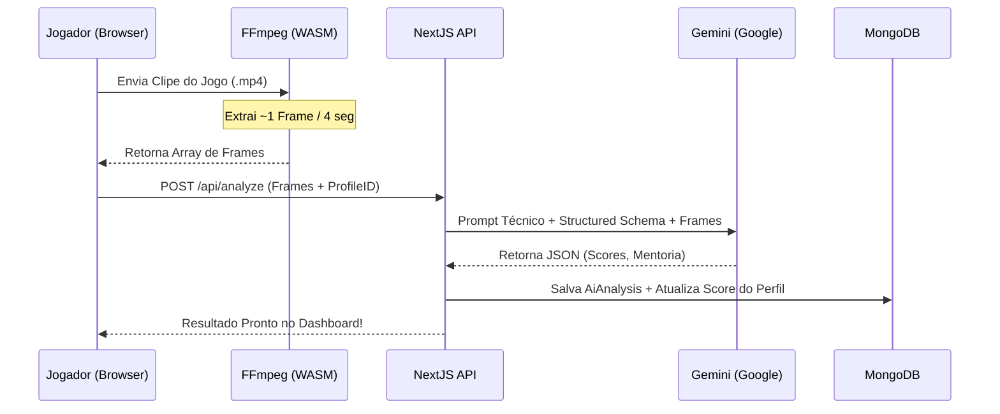

# Nexel

> **Um ecossistema de performance profissional e descoberta de talentos para jogadores de Free Fire.**

O **Nexel** é uma plataforma SaaS alimentada por IA desenvolvida para profissionalizar o cenário de e-sports. O ecossistema permite que jogadores elevem seu nível técnico usando análise avançada de visão computacional, compitam em desafios de arena e construam um portfólio rico em métricas para atrair o radar de olheiros e organizações competitivas.

---

## 🎯 Principais Funcionalidades

### 1. Vitrine de Talentos & Social Feed
Jogadores criam um perfil focado em métricas competitivas, contendo histórico de desempenho, `Global Score` e highlights. A plataforma oferece um feed filtrável para que **Scouts (Olheiros)** identifiquem novos talentos baseados em dados reais, não apenas em clipes editados.

### 2. Coach IA (PRO)
Através do processamento *client-side* com **FFmpeg WASM** e a tecnologia **Google Gemini 2.5 Flash**, os jogadores recebem uma análise técnica rigorosa de seus clipes. A IA avalia com precisão:
*   **Movimentação:** Agilidade, uso de HUD e posicionamento em combate.
*   **Uso de Gelo:** Velocidade de reação e eficiência das *Gloo Walls*.
*   **Eficiência de Rotação:** Inteligência de mapa, timing de zona e tomada de decisão.
*   **Relatório de Recrutador:** Feedback técnico detalhado com pontos de melhoria e elogios técnicos.

### 3. Arena de Desafios & Ranking
Módulo para confrontos (1v1 ou 4x4) com sistema de ranking global. O posicionamento no leaderboard é determinado pela consistência de vitórias e pelo score técnico atribuído pela IA, criando um ambiente competitivo meritocrático.

### 4. Monetização
Sistema de assinatura para o plano PRO, com suporte a depósitos e saques seguros.

---

## 🏗️ Arquitetura do Sistema

O projeto utiliza o **Next.js 16 App Router** com foco em performance e escalabilidade, adotando padrões de design modernos e tipagem estrita.

### Stack Tecnológica
*   **Frontend/Framework:** Next.js 16, React 19, Server Components.
*   **Estilização:** Tailwind CSS v4, Shadcn/UI, Framer Motion.
*   **Banco de Dados:** MongoDB Atlas com Mongoose ODM.
*   **Autenticação:** NextAuth.js v5 (Auth.js) com MongoDB Adapter.
*   **Inteligência Artificial:** Google Gemini 2.5 Flash (Structured Outputs & Context Caching).
*   **Processamento de Vídeo:** FFmpeg.wasm (Execução no navegador do cliente).

---

## 🔌 Documentação da API

A plataforma segue o padrão RESTful para suas rotas `/api`.

### Análise de IA
*   `POST /api/analyze`: Recebe frames de vídeo (base64) e o ID do perfil. Retorna um objeto JSON estruturado com scores e feedback técnico. Implementa *Context Caching* para otimização de custos e latência.

### Perfil e Social
*   `GET /api/profile/[id]`: Retorna os dados públicos do jogador, incluindo histórico de scores de IA.
*   `GET /api/feed`: Retorna a lista paginada de jogadores para scouting, com filtros por score e elo.
*   `GET /api/ranking`: Retorna o leaderboard global baseado em desempenho.

### Competições e Financeiro
*   `POST /api/challenges`: Criação e gerenciamento de salas de desafio.
*   `POST /api/subscription`: Gerencia o checkout via Stripe para o plano PRO.
*   `POST /api/webhook`: Endpoint para processamento de webhooks de pagamento.

---

## 🤖 Pipeline de IA e Performance

O **Nexel** resolve o desafio de processar vídeos em infraestrutura serverless através de uma estratégia híbrida:

1.  **Extração Local:** O FFmpeg.wasm extrai frames-chave no navegador do usuário.
2.  **Payload Otimizado:** Apenas frames essenciais são enviados para a API, reduzindo drasticamente o consumo de banda e tokens.
3.  **Structured Output:** A API força um esquema JSON determinístico no Gemini, garantindo que o frontend receba dados prontos para exibição sem alucinações.
4.  **Custo Reduzido:** Utiliza o sistema de Caching do Gemini para evitar re-processar prompts de sistema repetidos para o mesmo usuário no mesmo dia.

---

**Licença:** Este ecossistema é privado e proprietário, desenvolvido para a evolução do cenário competitivo de jogos mobile.
